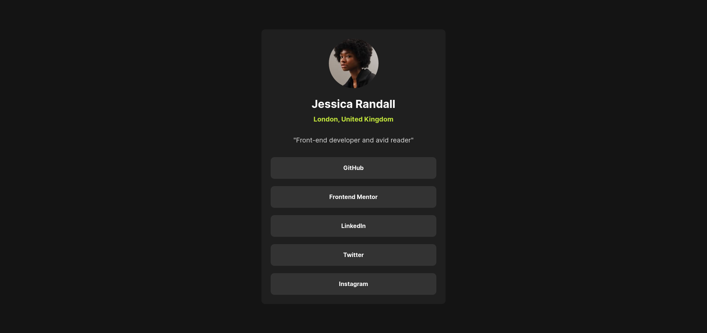
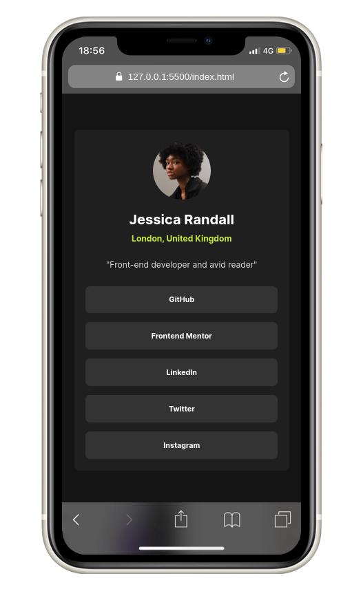

# Frontend Mentor - Social links profile

This is a solution to the [Recipe page challenge on Frontend Mentor](https://www.frontendmentor.io/challenges/recipe-page-KiTsR8QQKm). Frontend Mentor challenges help you improve your coding skills by building realistic projects.

## Table of contents

- [Overview](#overview)
  - [Screenshot](#screenshot)
  - [Links](#links)
- [My process](#my-process)
  - [Built with](#built-with)
  - [What I learned](#what-i-learned)
- [Author](#author)

## Overview

### Screenshot




### Links

- [Solution URL](https://github.com/lutfiismail52/social-links-profile/)
- [Live Site URL](https://lutfiismail52.github.io/social-links-profile/)

## My process

### Built with

- Semantic HTML5 markup
- CSS custom properties
- Mobile-first workflow

### What I learned

After completing this project, I gained a deeper understanding of several HTML elements that improve **semantics, accessibility, and security** in web development. Here are the things I learned:

1. Using `<address>` and the **`lang=""`** Attribute

    - `<address>` is used to display **contact information** such as a person's address, email, or location.
    - If the information in `<address>` is in a different language than the primary language of the document, then the `lang=""` attribute can be used to provide language context to **screen readers** and search engines. **Implementation Example:**

      ```html
      <address lang="en">London, United Kingdom</address>
      ```

    **Benefits:**
      - Helps **accessibility** for screen reader users.
      - Helps **SEO** by providing language information to search engines.

2. Using `<blockquote>` to Wrap Quotes
    - `<blockquote>` is used to **quote text from other sources** more semantically.
    - **Optional:** You can add `cite=""` to include the source of the quote. **Implementation Example:**

      ```html
      <blockquote cite="https://example.com">
      "The only way to do great work is to love what you do." — Steve Jobs
      </blockquote>
      ```

    **Benefits:**
      - Makes quotes more **structured and semantic**.
      - Facilitates **SEO and accessibility**, especially for screen readers.

3. Using `<nav>` for Navigation & `aria-label=""` Attribute
    - `<nav>` is used to wrap **a list of navigation links**, making it more semantic. - The `aria-label=""` attribute helps **screen readers** understand the purpose of navigation, especially if there are multiple `<nav>` elements on a single page. **Implementation Example:**

      ```html
      <nav aria-label="Social media links">
        <ul>
          <li><a href="https://github.com">GitHub</a></li>
          <li><a href="https://linkedin.com">LinkedIn</a></li>
        </ul>
      </nav>
      ```

    **Benefits:**
      - Helps **accessibility** for users who use assistive technologies.
      - Makes the HTML structure more **semantic and clear**.

4. Using `rel="noopener noreferrer"` for Security & Privacy
    - `rel="noopener noreferrer"` is used to **prevent tabnabbing attacks** and **protect user privacy**.
    - Must be used if the link is opened in a new tab (`target="_blank"`), because without it, the opened page can access `window.opener` and potentially exploit the user. **Implementation Example:**
      ```html
      <a href="https://example.com" target="_blank" rel="noopener noreferrer">Visit Example</a>
      ```

    **Benefits:**
      - **Better security** by preventing tabnabbing.
      - **Better privacy** by preventing sending referrers to the destination site.

5. Using `<section>` to Group Related Content
    - `<section>` is used to group **related content**, making it more structured.
    - Each `<section>` must have a **title or heading (`<h2>`, `<h3>`, etc.)** to make it easier for screen readers and search engines to understand. **Implementation Example:**
      ```html
        <section>
        <h2>About Me</h2>
        <p>I am a front-end developer and an avid reader.</p>
        </section>
      ```

    **Benefits:**
      - **HTML structure is neater** and easier to organize.
      - **Better SEO**, because search engines understand the parts of the page more clearly.

## Author

- Frontend Mentor - [@lutfiismail52](https://www.frontendmentor.io/profile/lutfiismail52)
- YouTube - [@kodedusk](https://www.youtube.com/@kodedusk)
- Instagram - [@lutfiismail47](https://www.instagram.com/lutfiismail47)
- Medium - [@lutfiismail47](https://medium.com/@lutfiismail47)